<div align="center">



<a href="https://github.com/akv2011">
  
</a>

<p>
  <a href="https://www.linkedin.com/in/arun-kumar-v-3217322a4"></a>
  <a href="https://github.com/akv2011"></a>
  <a href="https://arxiv.org/a/akv2011"></a>
  
</p>

</div>

---

### Currently

- Founding engineer at **Armoriq** — LLM security and MCP gateway infrastructure
- Building **Humanizer_** and **Voice_** — native macOS apps on Apple FoundationModels, CoreML, MLX, and WhisperKit
- Research in simulation-based inference, agent-based modeling, and LLM systems

### Selected Research

| Paper | Venue | Focus |
|---|---|---|
| **A-QCF-Net** | [arXiv:2512.21760](https://arxiv.org/abs/2512.21760) | Multimodal liver tumor segmentation · +7% Dice on LiTS / ATLAS |
| **DML** | [arXiv:2512.22290](https://arxiv.org/abs/2512.22290) | Algorithmic management and worker autonomy |

### Production Experience

| Company | Role | Domain |
|---|---|---|
| **Armoriq** | Founding Engineer | LLM security · MCP gateway |
| **CompasIQ** | Backend Engineer | FastAPI microservices on GCP |
| **Ionic Protocol** | Engineer | DeFi systems · RAG pipelines on AWS |

Research assistant at **NIT Tiruchirappalli** and **Anna University BIT Campus**.

### Recognition

- **Smart India Hackathon 2023** — National Winner
- Multiple preprint publications across ML and computational social science

### Tech Stack

<div align="center">

&nbsp;&nbsp;
&nbsp;&nbsp;
&nbsp;&nbsp;
&nbsp;&nbsp;
&nbsp;&nbsp;
&nbsp;&nbsp;
&nbsp;&nbsp;
&nbsp;&nbsp;
&nbsp;&nbsp;
&nbsp;&nbsp;
&nbsp;&nbsp;


</div>

```
Research        PyTorch · MLX · CoreML · WhisperKit · Apple FoundationModels
                Simulation-based inference · ABM · Diffusion · RAG

Apple Native    Swift · SwiftUI · CoreML · MLX · Xcode

Backend         Python · FastAPI · TypeScript · Node.js · Docker
                GCP · AWS · PostgreSQL · SQLite
```

### Activity

<div align="center">


<br/>


<br/>


<br/>


</div>

---

<div align="center">

<sub>Open to research collaboration · <code>github.com/akv2011</code></sub>

</div>
